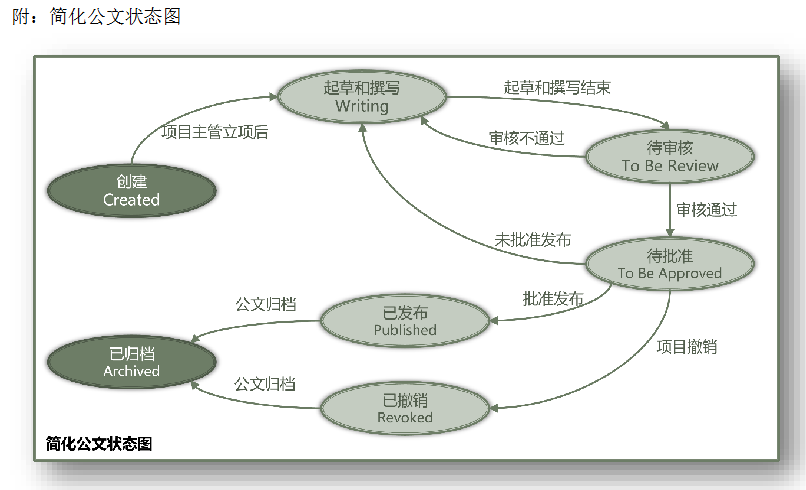

# Java-2026-Final-Project
# Document Management System (DMS) - 使用说明

## 目录
1. [系统概述](#系统概述)
2. [系统要求](#系统要求)
3. [安装说明](#安装说明)
4. [系统架构](#系统架构)
5. [用户角色与权限](#用户角色与权限)
6. [操作指南](#操作指南)
7. [公文流转流程](#公文流转流程)
8. [注意事项](#注意事项)
9. [常见问题](#常见问题)
10. [系统限制与已知问题](#系统限制与已知问题)
11. [技术说明](#技术说明)

---

## 系统概述

本公文管理系统（Document Management System, DMS）是一个基于Java的命令行应用程序，实现了公文从立项、起草、审核、批准、发布到归档的完整生命周期管理。

### 主要特性

- **设计模式应用**：采用观察者模式、状态模式和代理模式
- **用户角色管理**：支持四类用户（项目主管、秘书、官员、档案管理员）
- **权限控制**：基于角色的访问控制
- **通知系统**：自动通知相关用户文档状态变化
- **防御性编程**：完善的异常处理机制
- **时间追踪**：记录文档每个环节的处理时间

### 设计模式

- **观察者模式**：实现用户通知系统，当文档状态变化时自动通知相关角色
- **状态模式**：管理文档的7种状态及其转换
- **代理模式**：实现权限控制和用户认证

---

## 系统要求

### 运行环境
- Java Development Kit (JDK) 8 或更高版本
- 命令行终端（Windows CMD/PowerShell、macOS Terminal、Linux Shell）

---

## 安装说明

### 步骤1：确认Java环境

在命令行中输入以下命令检查Java版本：

```bash
java -version
```

应该看到类似以下输出：
```
java version "1.8.0_xxx" 或更高版本
```

如果未安装Java，请访问 [Oracle官网](https://www.oracle.com/java/technologies/downloads/) 下载并安装JDK。

### 步骤2：获取源代码

将所有源代码文件放置在同一目录下，确保包含以下文件：

**核心类文件：**
- `Main.java` - 主程序入口
- `DMS.java` - 文档管理系统核心
- `DMSProxy.java` - 代理类（权限控制）
- `Document.java` - 文档类

**观察者相关：**
- `Observer.java` - 观察者抽象类
- `Supervisor.java` - 项目主管
- `Secretary.java` - 秘书
- `Officer.java` - 官员
- `Archivist.java` - 档案管理员

**状态模式相关：**
- `DocumentState.java` - 状态接口
- `createdState.java` - 已创建状态
- `writingState.java` - 撰写中状态
- `reviewState.java` - 审核中状态
- `approvedState.java` - 待批准状态
- `publishedState.java` - 已发布状态
- `revokedState.java` - 已撤销状态
- `archivedState.java` - 已归档状态

### 步骤3：编译程序

在源代码所在目录打开命令行，执行：

```bash
javac *.java
```

编译成功后，目录中会生成相应的 `.class` 文件。

### 步骤4：运行程序

编译成功后，执行：

```bash
java Main
```

---

## 系统架构

### 文档状态流转图



### 类关系说明

**观察者模式：**
- `DMS` 作为被观察者，维护观察者列表
- `Observer` 及其子类作为观察者，接收文档状态变化通知

**状态模式：**
- `Document` 维护当前状态对象
- `DocumentState` 接口定义状态行为
- 7个具体状态类实现不同状态下的业务逻辑

**代理模式：**
- `DMSProxy` 代理 `DMS` 的所有操作
- 提供权限检查和用户认证功能

---

## 用户角色与权限

### 1. 项目主管 (Supervisor)

**权限：**
- 创建新文档（立项）
- 对文档进行立项操作
- 审核文档内容（通过/不通过）
- 查看所有文档状态和详情
- 管理个人通知

**默认用户：**
- 用户名：`alice`，真实姓名：Alice Wang
- 用户名：`bob`，真实姓名：Bob Chen

### 2. 秘书 (Secretary)

**权限：**
- 编辑文档内容
- 提交文档供审核
- 查看所有文档状态和详情
- 管理个人通知

**默认用户：**
- 用户名：`carol`，真实姓名：Carol Liu
- 用户名：`david`，真实姓名：David Zhang

### 3. 官员 (Officer)

**权限：**
- 批准文档（批准/不批准）
- 撤销项目
- 查看所有文档状态和详情
- 管理个人通知

**默认用户：**
- 用户名：`emma`，真实姓名：Emma Li
- 用户名：`frank`，真实姓名：Frank Wu

### 4. 档案管理员 (Archivist)

**权限：**
- 归档已发布或已撤销的文档
- 查看所有文档状态和详情
- 管理个人通知

**默认用户：**
- 用户名：`grace`，真实姓名：Grace Huang
- 用户名：`henry`，真实姓名：Henry Zhou

---

## 操作指南

### 启动系统

运行程序后，将看到欢迎界面：

```
Initializing Document Management System...
System initialized successfully!

========================================
  Document Management System (DMS)
========================================
```

### 主菜单

```
========== Main Menu ==========
1. Login
2. Register new user
3. View all users
0. Exit
===============================
```

#### 选项1：用户登录

1. 选择 `1` 进入登录界面
2. 输入用户名（小写，无空格）
3. 输入 `?` 可查看所有已注册用户
4. 输入 `back` 返回主菜单

**示例：**
```
Enter username (or 'back' to return): alice
[System] User logged in: Alice Wang (Supervisor)
```

#### 选项2：注册新用户

1. 选择 `2` 进入注册界面
2. 输入用户名（小写、无空格、唯一）
3. 输入真实姓名
4. 选择角色（1-4）：
    - 1: Supervisor (项目主管)
    - 2: Secretary (秘书)
    - 3: Officer (官员)
    - 4: Archivist (档案管理员)

**示例：**
```
Enter username (lowercase, no spaces): john
Enter real name: John Smith
Select role:
1. Supervisor (项目主管)
2. Secretary (秘书)
3. Officer (官员)
4. Archivist (档案管理员)
Enter choice (1-4): 1

[Success] User registered successfully!
Username: john
Real Name: John Smith
Role: Supervisor
```

#### 选项3：查看所有用户

显示系统中所有已注册用户，按角色分类显示。

#### 选项0：退出系统

安全退出程序。

---

## 公文流转流程

### 完整工作流示例

#### 步骤1：项目主管创建并立项

**登录：** alice (Supervisor)

1. 选择 `1. Create new document`
   ```
   Enter document title: 2026年度工作计划
   [Success] Document created: 2026年度工作计划
   Current state: Created
   ```

2. 选择 `2. Initiate project`
   ```
   --- Select Document ---
   1. Document: 2026年度工作计划 | State: Created
   0. Cancel
   
   Enter document number: 1
   Project initiated, moved to Writing state.
   [Success] Project initiated for: 2026年度工作计划
   ```

**系统通知：** Officer 和 Secretary 收到立项通知

#### 步骤2：秘书撰写内容并提交

**注销并登录：** carol (Secretary)

1. 选择 `1. Edit document content`
   ```
   --- Select Document ---
   1. Document: 2026年度工作计划 | State: Writing
   
   Enter document number: 1
   
   Current content:
   (Empty)
   
   Enter new content (type 'END' on a new line to finish):
   一、指导思想
   深入贯彻落实...
   
   二、主要目标
   1. 完成...
   2. 实现...
   END
   
   [Success] Content updated for: 2026年度工作计划
   ```

2. 选择 `2. Submit document for review`
   ```
   --- Select Document ---
   1. Document: 2026年度工作计划 | State: Writing
   
   Enter document number: 1
   Content submitted, moved to Review state.
   [Success] Content submitted for review: 2026年度工作计划
   ```

**系统通知：** Officer 和 Supervisor 收到提交审核通知

#### 步骤3：项目主管审核

**注销并登录：** alice (Supervisor)

1. 选择 `3. Review content`
   ```
   --- Select Document ---
   1. Document: 2026年度工作计划 | State: Under Review
   
   Enter document number: 1
   
   Document content:
   一、指导思想
   深入贯彻落实...
   
   二、主要目标
   1. 完成...
   2. 实现...
   
   Does the content pass review? (y/n): y
   Content passed review. Moving to approved state.
   [Success] Review completed for: 2026年度工作计划
   ```

**系统通知：** Officer 收到审核通过通知

#### 步骤4：官员批准

**注销并登录：** emma (Officer)

1. 选择 `1. Approve document`
   ```
   --- Select Document ---
   1. Document: 2026年度工作计划 | State: To Be Approved
   
   Enter document number: 1
   
   Document content:
   一、指导思想
   深入贯彻落实...
   
   Approving the document. Moving to Published state.
   [Success] Document approved: 2026年度工作计划
   ```

**系统通知：** Supervisor 和 Archivist 收到发布通知

#### 步骤5：档案管理员归档

**注销并登录：** grace (Archivist)

1. 选择 `1. Archive document`
   ```
   --- Select Document ---
   1. Document: 2026年度工作计划 | State: Published
   
   Enter document number: 1
   Archiving the published document.
   [Success] Document archived: 2026年度工作计划
   ```

**系统通知：** 所有用户收到归档通知

---

## 各角色操作菜单详解

### Supervisor（项目主管）菜单

```
[Supervisor Operations]
>>> You have X notification(s) <<<
1. Create new document          - 创建新文档
2. Initiate project             - 对文档进行立项
3. Review content               - 审核文档内容
4. View all documents           - 查看所有文档状态
5. View document details        - 查看文档详细信息
6. View my notifications        - 查看我的通知
7. Clear my notifications       - 清除我的通知
0. Logout                       - 注销
```

**操作说明：**

- **Create new document**: 输入文档标题创建新文档，新文档初始状态为 "Created"
- **Initiate project**: 选择状态为 "Created" 的文档进行立项，状态变为 "Writing"
- **Review content**: 选择状态为 "Under Review" 的文档进行审核，选择通过/不通过
    - 通过：状态变为 "To Be Approved"
    - 不通过：状态返回 "Writing"

### Secretary（秘书）菜单

```
[Secretary Operations]
>>> You have X notification(s) <<<
1. Edit document content        - 编辑文档内容
2. Submit document for review   - 提交文档供审核
3. View all documents           - 查看所有文档状态
4. View document details        - 查看文档详细信息
5. View my notifications        - 查看我的通知
6. Clear my notifications       - 清除我的通知
0. Logout                       - 注销
```

**操作说明：**

- **Edit document content**: 选择状态为 "Writing" 的文档编辑内容
    - 输入内容后，在新行输入 `END` 结束编辑
- **Submit document for review**: 选择状态为 "Writing" 且有内容的文档提交审核

### Officer（官员）菜单

```
[Officer Operations]
>>> You have X notification(s) <<<
1. Approve document             - 批准文档
2. Reject document              - 拒绝文档
3. Revoke project               - 撤销项目
4. View all documents           - 查看所有文档状态
5. View document details        - 查看文档详细信息
6. View my notifications        - 查看我的通知
7. Clear my notifications       - 清除我的通知
0. Logout                       - 注销
```

**操作说明：**

- **Approve document**: 选择状态为 "To Be Approved" 的文档批准，状态变为 "Published"
- **Reject document**: 选择状态为 "To Be Approved" 的文档拒绝，状态返回 "Writing"
- **Revoke project**: 选择状态为 "To Be Approved" 的文档撤销项目，状态变为 "Revoked"

### Archivist（档案管理员）菜单

```
[Archivist Operations]
>>> You have X notification(s) <<<
1. Archive document             - 归档文档
2. View all documents           - 查看所有文档状态
3. View document details        - 查看文档详细信息
4. View my notifications        - 查看我的通知
5. Clear my notifications       - 清除我的通知
0. Logout                       - 注销
```

**操作说明：**

- **Archive document**: 选择状态为 "Published" 或 "Revoked" 的文档归档，状态变为 "Archived"

---

## 通知系统

### 通知机制

系统采用静默通知机制，当文档状态变化时：
1. 系统自动向相关角色发送通知
2. 通知存储在用户的通知列表中
3. 用户登录后会看到通知数量提示
4. 用户可主动查看和清除通知

### 通知规则

| 状态转换 | 通知对象 | 通知内容 |
|---------|---------|---------|
| Created → Writing | Officer, Secretary | 项目已立项，等待内容起草 |
| Writing → Under Review | Officer, Supervisor | 内容已提交审核 |
| Under Review → To Be Approved | Officer | 内容审核通过，等待批准 |
| Under Review → Writing | Officer, Secretary | 内容审核不通过，返回撰写 |
| To Be Approved → Published | Supervisor, Archivist | 文档已批准发布 |
| To Be Approved → Writing | Supervisor, Secretary | 文档未批准，返回撰写 |
| To Be Approved → Revoked | Supervisor, Secretary, Archivist | 项目已撤销 |
| Published/Revoked → Archived | All users | 文档已归档 |

### 查看通知

选择菜单中的 "View my notifications"：

```
========== Your Notifications ==========
Total: 3 notification(s)

1. [2026年度工作计划] Project '2026年度工作计划' has been initiated...
2. [2026年度工作计划] Content of '2026年度工作计划' has been submitted...
3. [2026年度工作计划] Content of '2026年度工作计划' has passed review...
========================================
```

### 清除通知

选择菜单中的 "Clear my notifications"：

```
[Success] 3 notification(s) cleared.
```

---

## 注意事项

### 文档数量限制

- 系统最多同时管理 **10** 份文档
- 创建第11份文档时会收到错误提示
- 已归档的文档仍占用系统配额

### 状态转换限制

- 每个操作只能在特定状态下执行
- 状态转换遵循预定义的流程图
- 非法操作会被系统拦截并提示

### 权限控制

- 所有操作都经过 `DMSProxy` 进行权限检查
- 未登录用户无法执行任何操作
- 角色不匹配的操作会被拒绝

### 内容编辑

- 只能在 "Writing" 状态下编辑内容
- 提交审核前必须确保文档有内容
- 输入 `END` 结束内容编辑（独占一行）

### 异常处理

- 系统采用防御性编程策略
- 所有用户输入都经过验证
- 异常情况不会导致程序崩溃
- 错误信息清晰明确

---

## 常见问题

### Q1: 如何重置系统？

**A:** 重新运行程序即可。系统每次启动都会初始化为默认状态，包含8个预设用户和0份文档。

### Q2: 忘记用户名怎么办？

**A:** 在登录界面输入 `?` 或在主菜单选择 "View all users" 查看所有用户。

### Q3: 为什么无法编辑文档？

**A:** 检查以下几点：
- 是否以 Secretary 角色登录
- 文档是否处于 "Writing" 状态
- 是否选择了正确的文档

### Q4: 如何撤回已提交的文档？

**A:** 文档一旦提交，只能通过以下方式修改：
- Supervisor 审核时选择"不通过"
- Officer 批准时选择"拒绝"或"撤销项目"

### Q5: 已归档的文档可以修改吗？

**A:** 不可以。已归档文档处于最终状态，不能进行任何修改。

### Q6: 可以删除文档吗？

**A:** 当前版本不支持删除文档。文档只能归档，归档后占用系统配额。

### Q7: 如何查看文档的完整历史？

**A:** 选择 "View document details"，系统会显示：
- 文档标题
- 当前状态
- 文档内容
- 时间历史（每个状态变化的时间戳）

### Q8: 多个用户可以同时操作同一文档吗？

**A:** 可以，但由于采用命令行交互，实际是串行操作。系统会根据状态控制允许的操作。

### Q9: 通知会自动消失吗？

**A:** 不会。通知会一直保存，直到用户主动清除。

### Q10: 如何确认文档当前所处状态？

**A:** 有三种方式：
1. 选择 "View all documents" 查看所有文档状态
2. 选择 "View document details" 查看单个文档详情
3. 在选择文档时，文档列表会显示当前状态

---

## 系统限制与已知问题

### 系统限制

1. **并发限制**：单用户命令行程序，不支持多用户同时在线
2. **数据持久化**：程序关闭后数据不保存，每次重启恢复默认状态
3. **文档数量**：最多10份文档同时在系统中
4. **用户认证**：简化的用户名认证，无密码机制

### 功能限制

1. 不支持删除文档
2. 不支持修改用户信息
3. 不支持删除用户
4. 已归档文档不可恢复

---

## 技术说明

### 设计模式实现

**观察者模式 (Observer Pattern):**
- `DMS` 维护观察者列表，当文档状态变化时通知相关观察者
- 四类用户继承 `Observer` 抽象类，接收通知
- 支持按角色选择性通知

**状态模式 (State Pattern):**
- `Document` 对象维护7个状态对象
- 每个状态类实现 `DocumentState` 接口
- 状态转换逻辑封装在各状态类中

**代理模式 (Proxy Pattern):**
- `DMSProxy` 代理 `DMS` 的所有操作
- 提供统一的权限检查机制
- 管理用户会话

### 防御性编程

- 所有用户输入都经过验证
- 使用 try-catch 捕获异常
- 空值检查和边界检查
- 清晰的错误提示信息

---

**祝您使用愉快！**